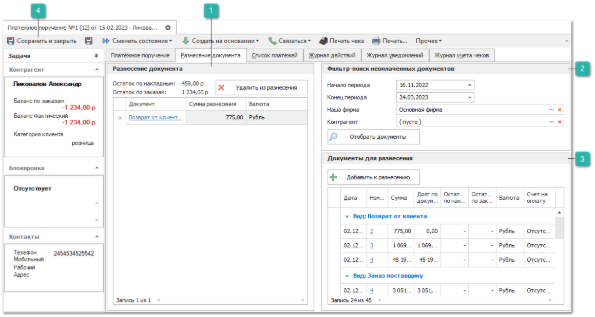
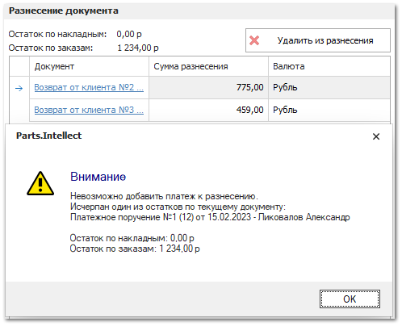

Разнесение платежа позволяет одним документом закрыть долг по заказам или накладным, либо закрыть другой платеж. При закрытии платежей друг другом, они не будут доступны для оплаты заказов или накладных.

Если требуется разнести один платеж по разным документам, то необходимо:

**»** Создайте и проведите платежный документ (**ПКО**, **РКО**, **ППвх**, **ПП**).

**»** Зайдите в платежный документ и перейти на вкладку **Разнесение платежа**.

::: note Замечание

Для обновления информации на вкладке нажмите клавишу F5.

:::

 **Разнесение документа**

Блок содержит список документов добавленных к разнесению. Кнопка **Удалить из разнесения** позволяет удалить выбранные позиции из списка. В полях **Остаток по накладным** и **Остаток по заказам** отображаются суммы, доступные для разнесения в рамках данного документа:

- **Остаток по накладным** – разносится на накладные по документам (**РН**, **ПН**, **ВК**, **ВП**);

- **Остаток по заказам** – разносится на заказы (**ЗК**, **ЗП**).

 **Фильтр-поиск неоплаченных документов**

Позволяет задать параметры фильтрации неоплаченных документов и осуществить их поиск.

Для фильтрации доступны значения:

- **Начало и конец периода** – позволяет задать временной период создания документов;

- **Наша фирма** – позволяет указать **Нашу фирму**, по которой будет осуществляться поиск документов;

- **Контрагент** – позволяет указать **Контрагента**, по которому будет осуществляться поиск документов.

 **Документы для разнесения**

Отображается список документов, удовлетворяющих требованиям фильтра. В данном списке будут присутствовать только проведенные и неоплаченные документы. Среди этих документов следует выбрать один или несколько документов, которые имеют отношение к выбранному документу. 

Кнопка **Добавить к разнесению** позволяет добавить выбранные документы в блок **Разнесение документа**.

 **Сохранить и закрыть/Сохранить**

Позволяет сохранить  внесенные в документ изменения.

::: note Замечание

Чтобы настроить запрет на редактирование уже созданного разнесения, в разделе **Управление ► Настройки программы**, вкладка **Роли пользователей ► Разрешения для роли пользователей ► Разнесение документа** отключите настройку **Можно редактировать разнесение документов** для нужных документов и пользователей.

:::

**»** Настройте **Фильтр-поиск неоплаченных документов**  осуществите фильтрацию выполнив команду **Отобрать документы**.

**»** На панели **Документы для разнесения платежа** выберете документы из списка и осуществите его добавление в блок **Разнесение документа**.

Если в редактируемом платеже один из остатков равен нулю, то разнесение на него другого платежа невозможно. Таким же образом происходит запрет на добавление к разнесению платежа, в котором один из остатков равен нулю.

Если к разнесению добавляется документ, долг по которому равен нулю, разнесение так же невозможно.

**»** Документ будет связан с платежом. В случае необходимости сумму разнесения можно отредактировать.

**»** Нажмите кнопку **Сохранить и закрыть/Сохранить** чтобы сохранить документ с разнесением.