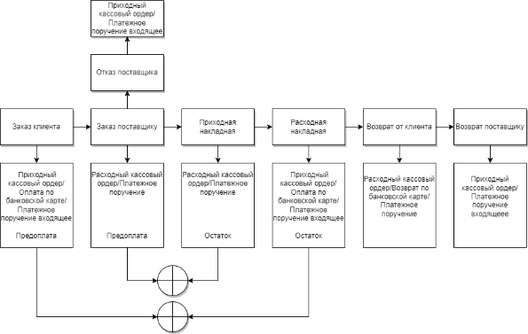

Программа Parts.Intellect способна работать с различными валютами. Для этого необходимо заполнить Справочник **Валюты и курсы**.

Справочник **Курсов валют** служит для преобразования цен из одних валют в другие. Стоит обратить внимание на то, что заполнять курс между валютами необходимо в обоих направлениях (как курс "Валюта1" к "Валюта2", так и курс "Валюта2" к "Валюта1"), либо воспользоваться настройкой **Автоматически вычислять обратный курс валют** в разделе меню **Управление ► Настройки программы ► Настройки**, группа **Системные настройки**.

Денежные выплаты в программе поделены на наличные и безналичные, на входящие и исходящие. Наличные выплаты фиксируются в программе документами **Приходный кассовый ордер** и **Расходный кассовый ордер**. При безналичных платежах создаются документы **Платежное поручение** и **Платежное поручение входящее**. При осуществлении безналичных платежей с помощью банковских карт через эквайринговый терминал создаются документы **Оплата по банковским картам** и **Возвраты по банковским картам**. Название этих документов отражает движение денег относительно Нашей фирмы. Платежные документы наиболее рационально создавать на основании документов, к которым они относятся.

<table><thead><tr><th valign="top"></th><th valign="top"></th><th colspan="2" valign="top">Направление платежа</th></tr>
<tr><td valign="top"></td><td valign="top"></td><td valign="top">Входящий (оплаты контрагентов)</td><td valign="top">Исходящий (выплаты контрагентам)</td></tr></thead>
<tbody><tr><td rowspan="3" valign="top">Вид платежа</td><td valign="top">Наличный</td><td valign="top">Приходный кассовый ордер</td><td valign="top">Расходный кассовый ордер</td></tr>
<tr><td valign="top">Безналичный</td><td valign="top">Платежное поручение входящее</td><td valign="top">Платежное поручение</td></tr>
<tr><td valign="top">Банковской картой</td><td valign="top">Оплата по банковской карте</td><td valign="top">Возврат по банковской карте</td></tr></tbody>
</table>

На схеме показан типовой вариант денежных расчетов в программе. В частном случае документы **Заказ клиента** или **Заказ поставщику** могут быть сразу полностью оплачены по факту поставки.

Для отслеживания денежных операций в программе предусмотрены отчеты **Акт сверки**, **Движение денег**, **Отчет о прибыли**, **Отчет о прибыли в разрезе прихода** и **Сколько заработано за день**. Каждый из отчетов имеет гибкие настройки отображаемых данных, что позволяет проанализировать множество различных срезов накопленной в программе информации.