При оплате клиентом с помощью банковской карты через эквайринговый терминал создается документ **Оплата по банковской карте.** Для создания документа выполните следующие действия:

**»** В **Главном меню** выберите пункт **Финансы** ► **Оплаты контрагентов** ► **Оплаты по банковской карте**. Отобразятся элементы выбранного пункта.   

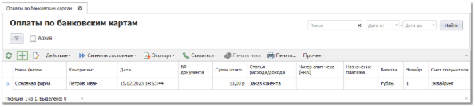

**»** Для добавления нового документа нажмите кнопку **Новый** на панели управления. Отобразится окно инспектора для добавления нового платежа. Заполните необходимые поля на форме (поля, выделенные жирным шрифтом обязательные для заполнения).

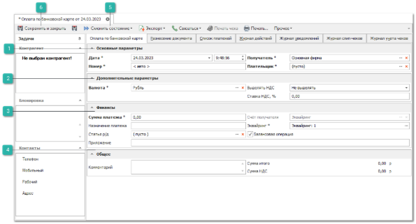

 **Основные параметры**

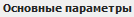

Блок содержит параметры:

- **Дата** – дата и время создания документа;

- **Номер** – номер документа. Номер присваивается автоматически после проведения документа;

- **Плательщик** – выбор контрагента, который оплачивает платеж;

- **Получатель** – контрагент **Нашей фирмы**, который получает платеж.

 **Дополнительные параметры**

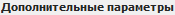

Блок содержит параметры:

- **Валюта** – валюта, в которой считаются цены по данному документу;

- **Выделять НДС** – позволяет включить/отключить выделение НДС по документу;

- **Ставка НДС** – процент ставки НДС.

 **Финансы**

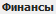

Блок содержит параметры:

- **Сумма платежа** – сумма, которая подлежит к оплате;

- **Назначение платежа** – описание назначения платежа;

- **Приложение** – поле для ввода реквизитов у документов, относящихся к назначению платежа;

- **Статья р/д** – статья расходов/доходов фирмы;

- **Счет получателя** – счет получателя платежа. Поле является не редактируемым, оно заполняется автоматически исходя из значения параметра **Счет в банке эквайере** используемого эквайрингового терминала;

- **Эквайринг** – терминал, с помощью которого будет происходить оплата по банковской карте;

- **Балансовая операция** – учитывать или нет платеж в балансовых операциях.

При наличии нескольких эквайрингов, доступных пользователю, совпадающих по 3 идентификаторам: **Активная Торговая точка, Наша Фирма документа, Пользователь**, при создании документа отобразится всплывающее окно для выбора необходимого эквайринга.

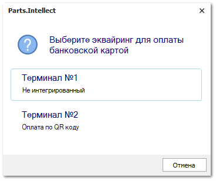

 **Общее**

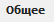

Блок содержит параметры:

- **комментарий** - позволяет указать общий комментарий к документу;

- **сумма итого** - отображает общую сумму по документу;

- **сумма НДС** - отображает сумму НДС по документу.

 **Сменить состояние**

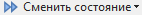

Позволяет осуществить проводку документа или отменить ее, в случае необходимости.  А также добавить документ в архив или извлечь его из архива. Для вступления документа в силу его необходимо провести. Для этого нажмите кнопку **Сменить состояние** и выберите пункт **Провести** (Ctrl+E).

В момент проводки инициируется обращение к подключенному терминалу, которая сопровождается окном процесса взаимодействия терминала и Parts.Intellect.

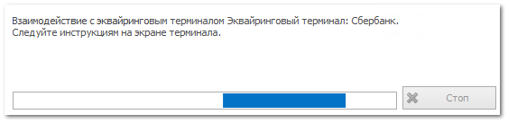

На POS-терминале отобразится интерфейс оплаты, на котором будет указана сумма платежа.

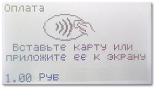

Если оплата прошла успешно, то отобразится окно, уведомляющее о успешном завершении операции.

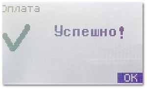

 **Сохранить и закрыть/Сохранить**

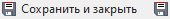

Позволяет сохранить и закрыть/сохранить документ без проводки.

::: note Замечание

После проведения документа можно разнести платеж.

:::

::: info Примечание

В случае, если используется интегрированный эквайринговый терминал, на ККТ, которая определяется по уникальной комбинации параметров: активная **Наша фирма** – активная **Торговая точка** – **Пользователь**, печатается полученный от терминала слип-чек в двух экземплярах.

:::