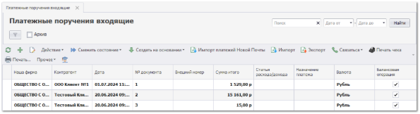
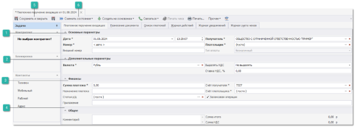
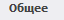
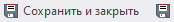
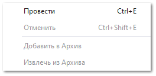

При возникновении необходимости зафиксировать доходы нашей фирмы в программе формируется документ **Платежное поручение** **входящее**. Для создания документа выполните следующие действия:

**»** В **Главном меню** выберите пункт **Финансы** ► **Оплаты контрагентов** ► **Платежные поручения входящие**. Отобразятся элементы выбранного пункта.

**»** Для добавления нового документа нажмите кнопку **Новый** на панели управления. Отобразится окно инспектора для добавления нового платежа. Заполните необходимые поля на форме (поля, выделенные жирным шрифтом обязательные для заполнения).

 **Основные параметры**

Блок содержит параметры:

- **Дата** – дата и время создания документа;

- **Номер** – порядковый номер документа. Номер присваивается автоматически после проведения документа;

- **Внешний номер** – внешний номер документа, для сторонних систем;

- **Плательщик** – выбор контрагента, который оплачивает платеж;

- **Получатель –** контрагент **Наша фирма**, который получает платеж;

- **Тип оплаты** – способ оплаты. 

::: info Примечание

В поле **Тип оплаты** по умолчанию задано значение **Безналичный**, изменение значения заблокировано программой.

:::

 **Дополнительные параметры**

Блок содержит параметры:

- **Валюта –** валюта, в которой считаются цены по данному документу;

- **Выделять НДС** – позволяет включить/отключить выделение НДС по документу;

- **Ставка НДС, %** – процент ставки НДС.

 **Финансы**

Блок содержит параметры:

- **Сумма платежа** – сумма, которая подлежит к оплате;

- **Назначение платежа** – описание назначения платежа;

- **Приложение** – поле для ввода реквизитов у документов, относящихся к назначению платежа;

- **Статья р/д** – статья расходов/доходов фирмы;

- **Счет получателя** – счет **Нашей фирмы** - получателя платежа;

- **Счет плательщика** – счет контрагента, который оплачивает платеж;

- **Балансовая операция** – учитывать или нет платеж в балансовых операциях.

 **Общее**

Блок содержит параметры:

- **комментарий** - позволяет указать общий комментарий к документу;

- **сумма итого** - отображает общую сумму по документу;

- **сумма НДС** - отображает сумму НДС по документу.

 **Сохранить и закрыть**

Позволяет сохранить и закрыть/сохранить документ без проводки.

 **Сменить состояние**

Позволяет осуществить проводку документа или отменить ее, в случае необходимости.  А также добавить документ в архив или извлечь его из архива. Для вступления документа в силу его необходимо провести. Для этого нажмите кнопку **Сменить состояние** и выберите пункт **Провести** (Ctrl+E).

::: note Замечание

После проведения документа можно разнести платеж.

:::