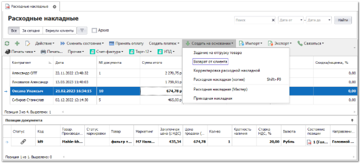
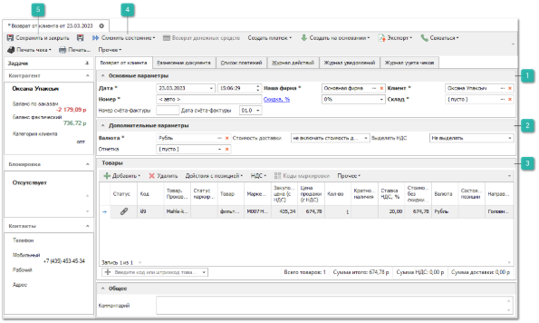
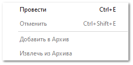
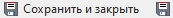

В случае возврата товара клиентом оформляется документ **Возврат от клиента**.

Для создания документа **Возврат от клиента** выполните следующие действия:

**»** В Главном меню выберите пункт **Продажи** **► Расходные накладные**. Отобразятся элементы выбранного пункта.  

**»** Выберите одну или несколько накладных, по которым необходимо создать возврат. На панели управления выполните команду **Создать на основании** и выберите пункт **Возврат от клиента**. 

::: info Примечание

На разных клиентов будут созданы разные документы возврата.

:::

::: info Примечание

Просмотр списка документов **Возврат от клиента** доступен из раздела **Продажи** ► **Возвраты клиентов**, из раздела также доступно создание нового документа, при этом параметры документа необходимо будет заполнить вручную.

:::

**»** Откроется окно инспектора документа. При необходимости заполните/отредактируйте параметры (обязательные для заполнения параметры выделены жирным шрифтом).

 **Основные параметры**

Блок содержит параметры:

- **Дата** – дата и время создания документа;

- **Номер** – номер документа. Возможен как ручной ввод, так и автозаполнение;

- **Наша фирма** – фирма, от имени которой будет создан документ;

- **Скидка/Наценка %** – значение процента скидки или наценки, которое применяется на все позиции документа. Доступ к полю определяется разрешением пользователя **Можно изменять скидку/наценку** в разделе меню **Управление ► Настройки программы ► Роли пользователей ► Документы ► Заказы клиентов**;

::: info Примечание

Значение можно указывать в процентах в поле **Скидка (расчетная), %**, или указать непосредственно **Сумму скидки.** Значения полей рассчитываются автоматически на основании значения второго поля.

:::

- **Клиент** – клиент, от лица которого оформляется возврат;

- **Склад** – склад, на который будет оприходован, возвращенный от клиента товар;

- **Номер** и **Дата счета-фактуры** – если есть необходимость формирования счета-фактуры, впишите номер и выберите дату для нее.

 **Дополнительные параметры**

Блок содержит параметры:

- **Валюта** – валюта документа;

- **Отметка** – отметка документа. Выбирается из справочника **Отметки в документах** (меню **Управление ► Справочники**).

- **Стоимость доставки** – влияние стоимости доставки на цену закупа:

    - **Не включать стоимость доставки** – суммарное значение по колонке **Стоимость доставки** не будет влиять на общую сумму документа;

    - **Включать стоимость без учета скидки** – сумма колонки **Стоимость доставки** будет прибавлена к сумме по документу;

    - **Включать стоимость с учетом скидки** – на стоимость доставки будет действовать **Скидка/Наценка, %** по документу.

- **Выделять НДС** – при необходимости, измените значение. По умолчанию значение берется из карточки **Нашей фирмы**.

 **Товары**

Блок содержит список **Товаров**. При создании документа на основании **Расходной накладной**, позиции автоматически будут скопированы из документа-родителя. При необходимости удалите лишние позиции/ измените количество товара на которое будет сформирован **Возврат клиента** (доступно изменение только в меньшую сторону).

Доступно добавление товаров в документ из следующих источников:

- **Из справочника** – позиция будет добавлена в документ без цен из справочника **Товары**;

- **Из справочника через проценку** – позицию можно будет выбрать вначале в справочнике товаров, а затем она будет передана в **Проценку** для подбора предложений;

- **Из проценки** – программа откроет окно **Проценки** для подбора позиций в документ;

- **Из корзины** – позиции будут добавлены из корзины;

- **Из мастера** – позволяет добавить позиции, которые необходимо заказать из **Мастера Заказа поставщику**;

- **Копия позиции** – создастся копия выделенной позиции документа.

Данные по позиции заполняются автоматически на основе информации из родительского заказа клиента или источника, из которого происходило добавление. При необходимости, заполните/измените данные по позиции.

Команда **Коды маркировки** позволяет открыть окно ввода кода маркировки товара.

::: info Примечание

Если вы введете код маркировки в документе **Возврат от клиента**, то такой код маркировки не войдет обратно в оборот. Вы можете ввести код маркировки обратно в оборот в личном кабинете на сайте «Честного знака».

Ввод кода маркировки может понадобится только для того, чтобы корректно сопоставить возвращаемый товар и провести документ **Возврат от клиента**.

:::

Работа с кодами маркировки и их ввод описаны в разделе **Заполнение кодов маркировки**.** 

::: info Примечание

Команда заблокирована, если в документе нет товаров, подлежащих маркировке или их количество (колонка **Кол-во**) равно 0.Возможность ввода кодов маркировки доступна только в не проведенном документе. После проведения доступен просмотр и копирование кодов.

:::

 **Сменить состояние**

Позволяет осуществить проводку документа или отменить ее, в случае необходимости.  А также добавить документ в архив или извлечь его из архива.

::: info Примечание

Проведение документа **Отказ клиента** ведет к увеличению количества товаров в свободном остатке (поле **В наличии на доступных складах**).

:::

 **Сохранить и закрыть/Сохранить**

Позволяет сохранить и закрыть/сохранить документ без проводки.

**»** Для вступления документа **Возврат от клиента** в силу, его необходимо провести. Для этого нажмите кнопку **Сменить состояние** и выберите пункт **Провести** (Ctrl+E). 

**»** Для того чтобы сохранить и закрыть документ (можно и без проведения), воспользуйтесь кнопкой **Сохранить и закрыть** (F2).