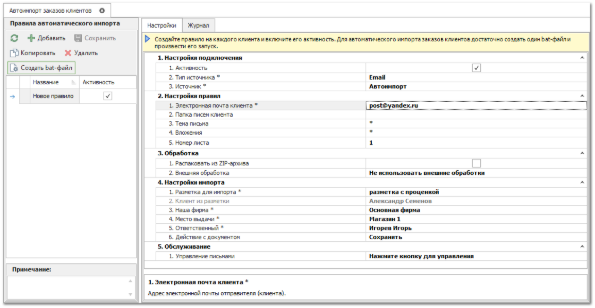
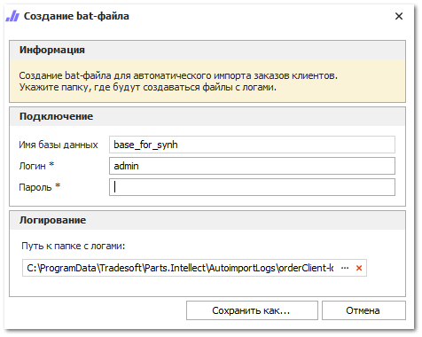
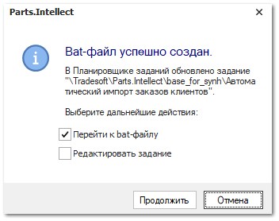

Для создания исполняемого файла автоматического запуска импорта заказов клиентов с почты в программу выполните следующие действия:

**»** В разделе **Автоимпорт заказов клиентов** в блоке **Правила автоматического импорта** нажмите кнопку **Создать bat-файл**, откроется окно создания bat-файла, для настройки автоматического импорта заказов с электронной почты.

**»** В открывшемся окне введите пароль пользователя программы и укажите путь к папке с файлами-журналами процесса импорта. По умолчанию используется путь:

::: note Пример

`C:\ProgramData\Tradesoft\Parts.Intellect\AutoimportLogs\orderClient-logs`

:::

**»** После заполнения всех полей нажмите кнопку **Сохранить как**. При успешном создании исполняемого файла откроется окно – уведомление об успешном создании bat-файла. 

В окне **Bat-файл успешно создан** доступны действия при выставлении отметки у пунктов: 

- **Перейти к bat-файлу** – открытие каталога файловой системы, содержащего сохраненный файл; 

- **Редактировать задание** – открытие формы редактирования задания планировщика для корректировки его параметров. Задание доступно для редактирования в любой момент времени через стандартные средства операционной системы Windows в Планировщике заданий по пути:

::: note Пример

Библиотека планировщика – Tradesoft – Parts.Intellect – Название базы данных – Автоимпорт прайс-листов.

:::

**»** В Планировщике заданий Windows автоматически создастся задание на выполнение сохраненного bat-файла с частотой раз в час.