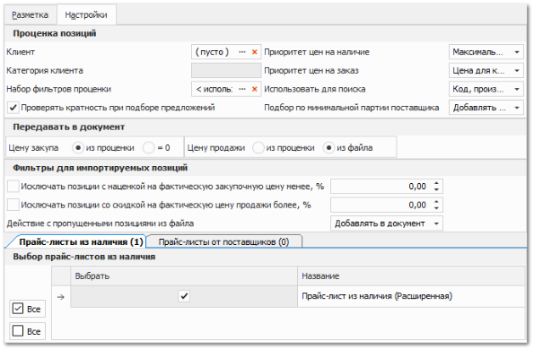

В программе есть возможность загружать заказы от клиентов из файла с автоматической проценкой позиций по заданным критериям. Инструмент **Импорта с проценкой** расположен в меню команды **Импорт** в списке **Заказов клиентов**.

Для загрузки заказа из файла выполните следующие действия:

**»** В **Главном меню** выберите пункт **CRM** ► **Заказы клиентов**.

**»** Нажмите кнопку **Импорт** и выберите пункт **С проценкой**.

**»** Появятся элементы для выбора файла с компьютера, который содержит импортируемые данные.

::: info Примечание

Системой поддерживаются следующие форматы файлов для загрузки:
- Файла MS Access (\*.mdb);
- Microsoft Excel 95-2003 (\*.xls);
- Microsoft Excel 2007-2013 (\*.xlsx, \*.xlsm);
- Файлы dBase (\*.dbf);
- Текстовые файлы с разделителями "точка с запятой", "запятая", "табуляция" (\*.txt, \*.csv).

:::

**»** После выбора файла откроется окно разметки файла для импорта. Выполните разметку файла используя подходящую ранее созданную разметку, либо выполните разметку файла вручную.

 **Ранее созданные разметки**

Блок  **Ранее созданные разметки**, содержит ранее созданные и сохраненные разметки документов. Если импорт в приход из аналогично размеченного файла уже осуществлялся, и в программе сохранена эта разметка, то рекомендуется выбрать ее в списке, не создавая новую. Блок содержит **Панель действий** с командами:

- **Обновить** – позволяет обновить список разметок;

- **Новая** – позволяет добавить новую разметку;

- **Копировать** – позволяет копировать существующую разметку, для дальнейшего редактирования;

- **Сохранить** – позволяет сохранить созданную или отредактированную разметку, которая будет доступна для последующего использования, в том числе для автоматизации импорта заказов клиентов с использованием bat-файла;

- **Удалить** – позволяет удалить существующую разметку.

 **Примечание**

Блок позволяет оставить текстовое примечание для разметки.

 **Разметка колонок**

Позволяет установить соответствия колонок в файле с типом данных в программе в колонке **Значение из файла/формула**. Некоторые значения (валюта, страна и т.п.) можно установить из соответствующего справочника в программе в колонке **Фиксированное значение из справочника**.

::: info Примечание

Поля **Код товара**, **Производитель**, **Количество**, **Валюта –** обязательные для разметки при импорте.

:::

::: info Примечание

При разметке файлов при импорте можно использовать предустановленные в программе специальные формулы для упрощения процесса импорта. 

:::

 **Информация об импортируемом файле**

Блок содержит:

Команду **Обновить** – которая позволят обновить данные о загруженном документе; 

- **Исходный файл** – содержит полный путь на компьютере до импортируемого файла, при необходимости его можно заменить;

- **Дата модификации** – отображается последняя дата изменения документа.

 **Табличная часть** 

Содержит список записей импортируемых из документа, с названием колонок для установки разметки.

 **Таблицы/листы документа**

Отображаются вкладки таблиц/листов документа, который хранит импортируемые данные. При необходимости, выберите необходимую вкладку.

 **Диапазон записей**

Позволяет указать количество верхних/нижних строк, данные из которых не будут импортированы. Обычно данный параметр используется для того, чтобы предотвратить загрузку заголовка и названия колонок импортируемой таблицы.

 **Настройки** 

На вкладке располагаются параметры критерия подбора (проценки) предложений на загружаемые товары:

- **Клиент** – клиент для определения категории клиента для выполнения проценки. Указанный клиент передается в новый заказ. Если клиент не указан, то проценка осуществляется для категории **Все элементы**;

- **Категория клиента** – актуальная категория выбранного клиента;

- **Набор фильтров проценки** – указывается набор фильтров, который будет использоваться при подборе предложений в импорте заказов. По умолчанию используется значение из **Настроек программы**. Доступные для выбора наборы фильтров, а также возможность их редактирования определяются разрешениями пользователя;

::: warning Внимание!

Если импорт с проценкой выполняется с набором фильтров, который на момент импорта является недоступным для пользователя, то он применяется при подборе результатов.

:::

- В набор имеет смысл включать следующие фильтры:

    - Фильтр позиций по остатку;

    - Фильтр по складам;

- **Приоритет цен на наличие** – указывается приоритет, по которому ранжировать подходящие цены (маркетинги) на позиции из источника "в наличии";

- **Приоритет цен на заказ** – порядок важности критериев цены/срок/остаток при подборе предложений под заказ. Программа каждому предложению поставщика устанавливает вес, учитывая эти критерии. А затем сортирует от лучшего предложения к худшему (по убыванию веса). Алгоритм расчета веса:

    - **Цена**. Разница между минимальной и максимальной ценой разбивается на 10 отрезков. Отрезок с минимальной ценой имеет вес 9, с максимальной – 0. Остальные предложения располагаются в промежутке от 0 до 9 в зависимости от того, в какой отрезок попала цена;

    - **Срок**:

        - 0 дней имеет вес 5;

        - 1 день имеет вес 4;

        - До 2-7 дней включительно имеет вес 3;

        - До 14 дней включительно имеет вес 2;

        - Более 14 дней либо срок не задан/не распознан имеет вес 1;

    - **Остаток**:

        - Остаток у поставщика число и его недостаточно для планируемого количества – вес 0;

        - Остаток у поставщика не задан или задан в нечисловом виде – вес 1;

        - Остаток у поставщика число и его достаточно для планируемого количества – вес 2.

Затем программа в соответствии с выбранным порядком важности критериев формирует вес. 

::: note Пример

Порядок Цена/Срок/Остаток и цена имеет вес 7, срок 4, остаток 1: значит итоговый вес позиции 741. И так по каждому предложению на товар.

:::

::: info Примечание

При выборе в критерии **Приоритет цен на заказ** варианта **Минимальная цена для клиента** отбор наилучшего предложения происходит по цене продажи товара. И лишь при равенстве цен нескольких предложений происходит дальнейшее сравнение по сроку и наличию.

:::

- **Использовать для поиска** – выбор из вариантов "Код, производитель" либо "Внутренний код";

- **Подбор по минимальной партии поставщика** – опция указывает, будет ли изменено значение колонки **Количество** в зависимости от содержимого колонки **Минимальная партия от поставщика** при импорте:

    - **Добавлять количество из исходного документа** – значение колонки **Количество** импортируется без изменений;

    - **Увеличивать количество до минимальной партии** – увеличивает значение колонки **Количество** до значения колонки **Минимальная партия от поставщика**;

    - **Пропускать предложения с минимальной партией** – в случае, если колонка **Минимальная партия поставщика** содержит какое-либо значение, при импорте позиция пропускается.

- **Проверять кратность при подборе предложений** – переключатель проверки количества импортируемых позиций на кратность;

- **Передавать в документ** – опция указывает, какие цены передавать в **Заказ клиента**:

    - Цена закупа: либо из проценки, либо пустая;

    - Цена продажи: либо из проценки, либо из импортируемого файла;

- **Фильтр для импортируемых позиций**:

    - **Исключать позиции с наценкой на фактическую закупочную цену менее, %** – ограничитель, позволяющий отсеивать позиции из файла с ценой продажи из файла менее "закупочной цены из проценки" с учетом указанной минимальной наценки. Т.е. если в файле цена продажи равна 90р, а цена закупа из проценки 50р, то при минимальной наценке 50% позиция будет импортирована (50\*1,5=75, что меньше, чем 90р из файла), а при минимальной наценке 100% нет (50\*2=100, что больше, чем 90р из файла);

    - **Исключать позиции со скидкой на фактическую цену продажи более, %** – ограничитель, позволяющий отсеивать позиции из файла с ценой продажи из файла менее "цены продажи из проценки" с учетом указанной максимальной скидки. Т.е. если в файле цена продажи равна 90р, а цена продажи из проценки 100р, то при максимальной скидке 25% позиция будет импортирована (100\*0.75=75, что меньше чем 90р из файла), а при минимальной наценке 5% нет (100\*0.95=95, что больше чем 90р из файла);

    - **Действия с пропущенными позициями из файла** – действие над пропущенными позициями. Позиции могут пропускаться из-за отсутствия в прайс-листах, из-за недостаточного количества в наличии, из-за превышения допустимых расхождений по цене из файла и текущих цен.

Данные позиции можно выгружать в log-файл для дальнейшего анализа. А можно включить возможность добавления в документ с актуальным количеством (0 – если совсем не смогли подобрать, меньшим планового количества – если подобрали частично). При этом плановые цена и количество передаются в соответствующие ячейки позиции заказа;

::: info Примечание

Порядок применения фильтров при импорте с проценкой:
- Набор фильтров проценки;
- Приоритет цен;
- Фильтр для импортируемых позиций.

:::

- **Выбор прайс-листов** – на трех вкладках указываются прайс-листы, по которым необходимо осуществлять поиск товаров из файла.

**»** После установки всех параметров разметки загрузки нажмите кнопку **Сохранить**, если требуется сохранить текущую разметку. Созданная конфигурация импорта будет сохранена и доступна для повторного использования.

**»** Для продолжения загрузки нажмите кнопку **Далее.** Откроется окно с параметрами загрузки. 

**»** Для изменения параметров нажмите кнопку **Назад**. Для начала процесса импорта нажмите **Начать**!

**»** В процессе импорта программа подберет соответствующие ценовые предложения на позиции в прайс-листах и добавит их в документ, а пропущенные позиции выведет в отельный лог-файл.

В первую очередь проценка позиций из файла осуществляется в прайс-листе из наличия. При этом приоритет наличия сохраняется даже в случае частичного подбора. Т.е. если в файле позиция в количестве 10 шт., а в наличии только 3 шт., то программа свяжет 3 шт. из наличия, а остальные 7 будет искать под заказ. Во вторую очередь осуществляется поиск в выбранных прайс-листах от поставщиков. Причем с учетом остатков, если они заданы в прайс-листе в числовом виде. Подбор товаров осуществляется с учетом указанных настроек и фильтров.

По окончанию импорта отобразится диалоговое окно с результатами поиска.

**»** Для вступления документа **Заказ клиента** в силу его необходимо провести. Для этого нажмите кнопку **Сменить состояние** и выберите пункт **Провести** (Ctrl+E).

**»** Для того чтобы сохранить и закрыть документ (можно и без проведения) воспользуйтесь кнопкой **Сохранить и закрыть** (F2).