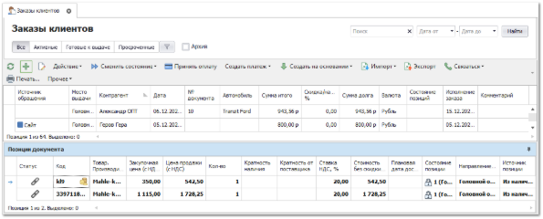
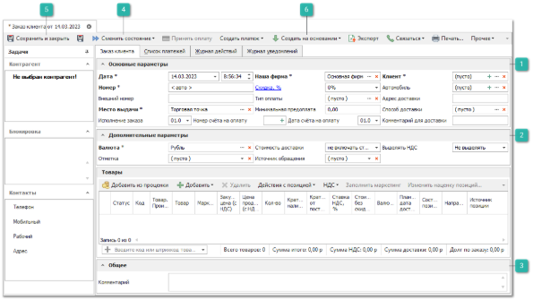
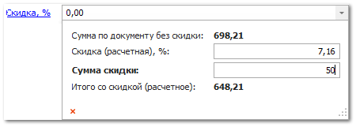
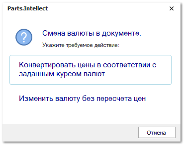
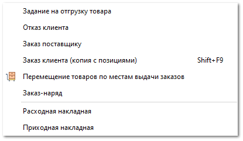
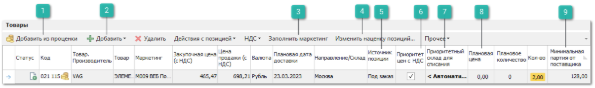
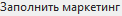
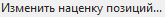
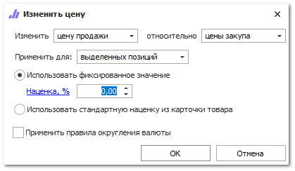

Для создания нового заказа от клиента выполните следующие действия:

**»** В **Главном меню** выберите пункт **CRM ► Заказы клиентов**. 

**»** Для добавления нового документа нажмите кнопку **Новый** на панели управления. Отобразится окно инспектора для добавления нового заказа.

**»** Заполните необходимые параметры документа (обязательные для заполнения поля выделены жирным шрифтом):

**Основные параметры**

Блок содержит поля:

- **Дата** – дата и время создания документа;

::: info Примечание

Для определения даты и времени программа использует данные компьютера пользователя или время компьютера, где расположена база данных, при активной настройке **Использовать локальное время сервера БД** в разделе меню **Управление ► Настройки программы ► Настройки**, блок **Системные настройки**.

:::

- **Номер** – порядковый номер документа (доступен ручной ввод). Формат и счетчик для формирования номера документа определяется правилом в разделе меню **Управление ► Справочники ► Счетчик номеров документов**;

::: info Примечание

Возможность ручного редактирования Даты и Номера документа для пользователя определяется опциями **Можно редактировать дату и время документа** и **Можно редактировать номер документа** в разделе меню **Управление ►** **Настройки программы ► Роли пользователей ► Документы ► Заказы клиентов**.

:::

- **Внешний номер** – внешний номер документа;

::: info Примечание

Для пользователя может быть разрешено изменения поля **Внешний номер** даже после проводки документа. Разрешение регулируется опцией **Можно изменять внешний номер документа после проводки** в разделе меню **Управление ► Настройки программы ► Роли пользователей** **► Документы ► Заказы клиентов**.

:::

- **Плановая дата исполнения** – значение рассчитывается автоматически на основании значения самой поздней **Плановой даты доставки** среди позиций документа. Подразумевается, что весь заказ может быть полностью исполнен, когда будет доставлена последняя деталь из заказа;

::: info Примечание

Значение поля **Плановая дата исполнения** не может быть меньше, чем значение поля **Дата**.

:::

- **Статус заказа** – значение устанавливается программой. Для вычисления статуса используются данные о состоянии позиций, проводке, плановой дате исполнения и дате готовности к выдаче. Поле **Статус заказа** принимает следующие значения:

- **Новый** – документ **Заказ клиента** не проведен;

- **В работе** – позиции документа **Заказ клиента** не готовы к выдаче и требуют внимания менеджера;

- **В работе, просрочен** – позиции документа **Заказ клиента** не готовы к выдаче, требуют внимания менеджера, а значение поля **Плановая дата исполнения** раньше текущей даты;

- **Ожидает выдачи, n дней** – позиции документа **Заказ клиента** готовы к выдаче, а значение поля **Дата готовности к выдаче** раньше текущей даты на **n** дней;

- **Исполнен** – все позиции документа **Заказ клиента** достигли конечного состояния: **Возврат от клиента**, **Отказ клиента**, **Расходная накладная**, **Заказ-наряд**, **Корректировка расходной накладной**;

- **Наша фирма** – наша фирма на которую оформляется заказ;

- **Место выдачи** – торговая точка, с которой предполагается выдавать товар клиенту. Данное место выдачи используется при отправке **Уведомления о готовности заказа**, а так же для создания документа **Перемещение** на основании **Приходной накладной**, который позволяет автоматически распределить товар на места выдачи;

::: info Примечание

При активной опции **Учитывать место выдачи товара** в **Заказе клиента** в разделе меню **Управление ►** **Настройки программы ► Настройки,** группа **Уведомления** уведомление о готовности заказа клиента к выдаче будет уходить только в случае, если товар был оприходован либо перемещен на склад/торговую точку, которая указана в качестве **Места выдачи** товара в параметрах **Заказа клиента**.

:::

- **Скидка/Наценка, %** (значение меняется при нажатии на имя поля) – значение процента скидки или наценки, которое применяется на все позиции документа. Доступ к полю определяется разрешением пользователя **Можно изменять скидку/наценку** в разделе меню **Управление ► Настройки программы ► Роли пользователей ► Документы ► Заказы клиентов**. Значение можно указывать в процентах в поле **Скидка (расчетная), %**, или указать непосредственно **Сумму скидки**. Значения полей рассчитываются автоматически на основании значения второго поля;

- **Тип оплаты** – выберите способ внесение **Предоплаты** по документу по словарю **Способы оплаты**;

- **Минимальная предоплата –** сумма предоплаты за заказ. Рассчитывается автоматически на основании процента, заданного в настройке **Минимальный % предоплаты по ЗК**, в разделе меню **Управление ► Настройки программы ► Настройки**, группа **CRM ► Контрагенты** – для всех клиентов или с помощью аналогичной настройки в карточке клиента в разделе **CRM** **► Клиенты**, вкладка **Финансы**. Настройка в карточке клиента имеет наивысший приоритет. Полученная сумма предоплаты округляется до целого в большую сторону, редактирование суммы вручную недоступно.

::: info Примечание

Для применения процента необходимо также активировать опцию **Запретить проводить ЗК без минимальной предоплаты** (раздел **Управление ► Настройки программы ► Роли пользователей ► Документы ► Заказы клиентов**). При активном значении настройки проведение документа **Заказ клиента** без внесения предоплаты будет недоступно.

:::
::: info Примечание

При наличии суммы **Минимальной предоплаты** во время проведения заказа будет открыт интерфейс оплаты, в поле ввода автоматически проставится сумма, равная **Минимальной предоплате** (внесение суммы меньше недоступно). После принятия оплаты будет создан платежный документ и долг по документу сократится на сумму предоплаты.Отобразить интерфейс оплаты без использования предоплаты можно с помощью опции **Предлагать оплатить документ при проводке** в разделе **Управление ► Настройки программы ► Роли пользователей ► Документы ► Заказы клиентов**. Способы оплаты определяются настройкой **Доступные типы оплат** в том же разделе.

:::

- **Номер счета на оплату** и **Дата счета на оплату** – если есть необходимость формирования счета на оплату для клиента, нажмите на кнопку  для присвоения номера новому счету (распечатать счет можно через команду **Печать**). **Дата счета на оплату** устанавливается автоматически, для изменения даты нажмите на кнопку  и выберите нужную дату с помощью календаря;

- **Клиент –** клиент, который заказывает товар. Клиента можно выбрать из справочника контрагентов, открыть форму для создания нового или ввести данные клиента для поиска по справочнику. Поиск ведется по наименованию, коду, номеру дисконтной карты, номерам телефона и мобильного телефона, электронной почте, номеру ИНН, а также системному штрихкоду клиента. При вводе текста предлагается список клиентов из справочника, у которых встречается введенная последовательность символов. Если был выбран существующий контрагент из справочника, то программа привяжет его к документу.

::: info Примечание

Если в карточке контрагента заполнены поля **Способ доставки по умолчанию**, **Адрес доставки**, а на вкладке **Автомобили** есть добавленные автомобили, то при выборе этого клиента в документе **Заказ клиента**:в поле **Автомобиль** появится выпадающий список с возможностью выбрать автомобиль клиента;
в поле **Способ доставки** подставится значение из карточки;
в поле **Адрес доставки** подставится значение из карточки.

:::

В дополнение к этому, при выборе клиента из справочника **Контрагентов** в поле **Автомобили** открывается список автомобилей, принадлежащих данному клиенту;

- **Автомобиль** – автомобиль клиента. В поле отображается: марка и модель автомобиля, VIN-код, год выпуска, объем, типа и номер двигателя (при условии, что данная информация внесена в справочник **Автомобили**);

- **Способ доставки** и **Адрес доставки** – укажите способ доставки товара и адрес клиента;

- **Комментарий для доставки** – поле для ввода комментария.

**Дополнительные параметры**

Блок содержит поля:

- **Валюта** – валюта цен в документе. Если изменить валюту документа программа предложит сконвертировать цены на позиции к валюте документа по текущему курсу для валют;

- **Отметка** – выберите отметку для документа из справочника;

- **Стоимость доставки** – укажите влияние стоимости доставки на цену закупа:

- **Не включать стоимость доставки** – суммарное значение по колонке **Стоимость доставки** не будет влиять на общую сумму документа;

- **Включать стоимость без учета скидки** – сумма колонки **Стоимость доставки** будет прибавлена к сумме по документу;

- **Включать стоимость с учетом скидки** – на стоимость доставки будет действовать **Скидка/Наценка, %** по документу;

- **Источник обращения** – источник добавления документа в журнал. Возможные источники и отметки:

 – документ был передан с сайта Parts.Resource при тике синхронизации;

 – документ был создан из окна звонка. Доступно при наличии подключенной IP-телефонии;

 – источник, который можно присвоить документам вручную;

 – документ загружен с почты с использованием правила из раздела **CRM ► Автоимпорт заказов клиентов**.

Источники **Сайт**, **Звонок**, **Email** присваиваются документам автоматически. При необходимости источник можно изменить вручную.

::: info Примечание

Отредактировать источники и цвета отметок можно в разделе **Управление** ► **Справочники** ► **Источники обращений**.

:::

- **Выделять НДС** – определяет наличие ставки НДС при расчете стоимости позиций, по умолчанию значение берется из карточки **Нашей фирмы**. При необходимости значение можно изменить.

**Общее**

Блок содержит поле ввода комментария к заказу. 

**Сменить состояние**

Позволяет осуществить проводку документа или отменить ее, в случае необходимости.  А так же добавить документ в архив или извлечь его из архива.

**Сохранить и закрыть/Сохранить** 

Позволяет сохранить и закрыть/сохранить документ **Заказ клиенту** без проводки.

**Создать на основании**

На основании заказа клиента можно создать ряд документов для отражения реальных бизнес-процессов. Например, если клиент отказывается от части или всего заказа, то создается **Отказ клиента**. Для передачи заказ далее по цепочки поставщику, оформляется **Заказ поставщику** и т.д. В дополнение к этому можно создавать копию заказа клиента, с позициями или без.

**»** Добавьте необходимые товары в табличную часть **Заказа клиента**. Табличная часть содержит список добавленных позиций, а так же ряд команд для выполнения действий над ними. 

**Добавить из проценки**

Позволяет открыть инструмент проценки, для поиска и добавления в документ необходимых позиций.

**Добавить**

Позволяет добавить товары в заказ**.** Доступны следующие источники позиций:

- **Из справочника** – позиция будет добавлена в документ без цен из справочника **Товары**;

- **Из справочника через проценку –** позицию можно будет выбрать вначале в справочнике товаров, а затем она будет передана в **Проценку** для подбора предложений;

- **Из корзины** – позиции будут добавлены из корзины;

- **Копия позиции** – создастся копия выделенной позиции документа.

Данные по позиции заполняются автоматически на основе информации в источнике, из которого происходило добавление.

Для проведения заказа клиента достаточно заполненной информации **Код** и **Товар**. **Производитель**. При необходимости, заполните/измените данные по позиции.

**Заполнить маркетинг**

Позволяет автоматически подставить информацию о позиции из существующих маркетингов. Доступна подстановка:

- **Закупочной цены** **(с НДС)** – цена закупа детали у поставщика;

- **Цены продажи (с НДС)** – цена на товар с учетом маркетинга;

- **Направления/ склада** – направление поставки или склад из прайс-листа;

- **Приоритетного склада для списания** – склад, с которого требуется осуществлять списание товара;

::: info Примечание

Заполнить маркетинг можно как для одной позиции из документа, нажав кнопку **Обновить**, так и для всех, нажав кнопку **Для всех** в открывшемся окне.Функция **Заполнить маркетинг** в **Заказах клиентов** доступна только для позиций с пустым полем **Маркетинг** из источников: **Прайс-листов наличия** и **Прайс-лист поставщика**.Функция активна только для не проведенных документов.

:::
::: info Примечание

Для подстановки цен по позиции выполняется проценка с поиском позиции в источниках (из маркетинга, под заказ, из наличия, в пути). Проценка осуществляется в 3 этапа, поиск позиции осуществляется по точному совпадению, поиск по аналогам и синонимам не осуществляется:**1 этап**:
Проверка источника на доступность (в соответствии с разрешениями пользователя в разделе **Управление** **► Настройки программы ► Разрешения для роли пользователей ►  Прайс-листы**;
Получение товара из прайс-листа;
Загрузка списков маркетингов;
Разбитие позиции по складам;
Выбор подходящего маркетинга (проверка по диапазону цен, группе скидок, производителю, группе товаров и т.д.);
Для товаров в наличии: исключение позиций с неподходящим складом/ Торговой точкой, на которой расположен товар (в соответствии с выбранным Складом/ Торговой точкой в документе);
Исключение маркетингов, не подходящих по категории клиента;
Для каждого подходящего маркетинга высчитывается цена;
Выбор одного маркетинга по весам.
- **2 этап**:
Удаление дубликатов из списка процененных позиций товара;
- **3 этап**:Возврат списка процененных позиций из разных источников. В качестве результата берется первый из списка товар.Для партионной СЦО выполняется сортировка по дате из **Приходной накладной**. Выбор позиции товара из проценки зависит от настройки **Способ списание товара** (**ЛИФО**, **ФИФО**), который задается в разделе **Управление ► Настройки программы ► Настройки ►** группа **Склад и закупки ► Движение товара**. Если в списке присутствуют только позиции из **Прайс-листов поставщиков**, по которым нет **Приходных накладных** – сортировка не выполняется. 

:::

**Изменить наценку позиций**

Позволяет установить наценку, либо скидку на выделенные позиции. На форме указывается от какой цены необходимо начислять наценку или скидку, а также размер скидки/ наценки: фиксированный; из карточки товара. Далее с помощью опции **применить правила округления валюты** можно округлить полученное значение.

**Источник позиций**

В колонке указывается, из какого источника осуществлять списание позиции: из маркетинга, из наличия, под заказ или в пути. Первый источник списания является автоматическим (программа принимает решение на основании информации в маркетинге). А остальные два принудительными, когда строго требуется списать товар или его заказать.

- **Из маркетинга** – значение по умолчанию для новых позиций. Источник для списания будет определяться по маркетингу: из наличия или под заказ. Например, из Проценки добавлены в документ две позиции: одна с маркетингом от прайс-листа из наличия, другая с маркетингом от прайс-листа под заказ. При проведении такого документа программа обратиться к источнику списания из маркетинга и спишет одну позицию из наличия, другую поставит под заказ;

- **Под заказ** – значение строго указывает на источник списания "под заказ". Т.е. даже если позиция есть в наличии, она все равно встанет "под заказ";

- **Из наличия** – значение строго указывает на источник списания "из наличия". Т.е. если позиция есть в наличии, то она спишется из наличия. Если позиции в наличии нет, то программа не даст провести документ ввиду недостаточного количества товара на складе. В этом случае можно сменить источник позиции на "под заказ" и при проведении документа позиция встанет "под заказ";

- **В пути** – значение строго указывает на источник списания "заказ поставщику". Т.е. если позиции в наличии нет, но она уже заказана у поставщика, то она автоматически будет связана с Заказом клиента, а во время проводки приходной накладной, позиция автоматически зарезервируется для созданного Заказа клиенту.

**Приоритет цен с НДС** 

Определяет ключевую цену, на основании которой будет высчитываться вторая цена при переключении в параметрах документа значения **Выделять НДС**:

если для позиции активирована опция **Установить** **приоритет цен с НДС**, то при включении переключателя **Выделять НДС** значение в колонке **Цена с НДС** не изменится, а **Цена без НДС** рассчитается на ее основании;

убрать приоритет цен можно с помощью опции **Снять приоритет цен с НДС**, если приоритет снят, то при включении переключателя **Выделять НДС** значение в колонке **Цена без НДС** не изменится, а **Цена с НДС** рассчитается на ее основании.

**Приоритетный склад для списания**

Позволяет указать **Приоритетный склад для списания**. С помощью данного поля можно выбрать склад и место хранения, с которых требуется осуществлять списание товара.

Указать приоритетный склад для списания можно как в самой позиции документа, так и сразу для нескольких позиций с помощью команды **Приоритетный склад** (в пункте **Действия с позицией**) на панели инструментов. При этом **Место хранения**, с которого необходимо выполнить списание товара можно выбрать только по позиции документа.

::: info Примечание

В случае отсутствия товара на выбранном **Складе**, списание товара будет произведено со вложенных в этот склад **Мест хранений** (при активном значении настройки **Подбирать товары сначала на приоритетном складе/ТТ, а затем на вложенных в него МХ** из раздела **Управление ► Настройки программы ► Настройки ►** группа **Склад и закупки** ► **Движение товара**).В случае отсутствия товара на выбранном **Месте хранения**, списание товара будет произведено со вложенных в него **Мест хранений** (при активном значении настройки **Перемещать товары сначала с выбранного МХ, а затем с вложенных в него МХ** из раздела **Управление ► Настройки программы ► Настройки ►** группа **Склад и закупки** ► **Движение товара**).

:::
::: info Примечание

В разрешениях пользователя (**Управление ► Настройки программы ► Роли пользователей ► Разрешения для роли пользователей ► Документы ► Заказы клиента** доступна опция **Списание/резервирование товаров со складов/МХ, отличных от приоритетного**, которая активирует проверку доступного количества товара на складе при проводке документа. Если количество товара из наличия недостаточно, то программа выдаст соответствующее уведомление.

:::

По умолчанию списание товара (в момент проводки) будет осуществляться среди всех складов **Доступных для списания** пользователю, по действующему в системе **Способу списания товара ФИФО/ЛИФО** в разделе меню **Управление ► Настройки программы ► Настройки ►** группа **Склад и закупки ► Движение товара**.

**Плановая цена и Плановое количество**

Позволяют внести цену и количество товара, которые передает клиент. Если они заполнены, программа сверяет Цену продажи и Плановую цену, а также фактическое количество и плановое. И на основании этого сравнения расцвечивает ячейки с плановыми показателями. 

Правила расцвечивания **Плановой цены**:

если плановая цена ниже фактической – желтым цветом;

если плановая цена равна фактической – зеленым цветом;

если плановая цена больше фактической – красным цветом.

Правила расцвечивания **Планового количества**:

если плановое количество больше фактического, а фактическое больше 0 – желтым цветом;

если плановое количество равно фактическому – зеленым цветом;

если плановое количество больше фактического, а фактическое равно 0 – красным цветом.

::: info Примечание

Данная расцветка позволяет загрузить (через импорт)/заполнить плановые цену и количество. А потом визуально ориентироваться по расцветке об успешности подбора товара для клиента.

:::

**Минимальная партия от поставщика**

Содержит значение минимального количества единиц товара от поставщика под заказ. Если значение в колонке **Количество** меньше, чем в **Минимальная партия от поставщика**,** то содержимое такой колонки будет расцвечено желтым цветом.

**»** Данные по позиции заполняются автоматически на основе информации в источнике, из которого происходило добавление. Для проведения заказа клиента достаточно заполненной информации **Код** и **Товар**. **Производитель**. При необходимости, заполните/измените данные по позиции.

**»** Для вступления документа **Заказ клиента** в силу его необходимо провести. Для этого нажмите кнопку **Сменить состояние** и выберите пункт **Провести** (Ctrl+E).

**»** Для того чтобы сохранить и закрыть документ (можно и без проведения) воспользуйтесь кнопкой **Сохранить и закрыть** (F2).

