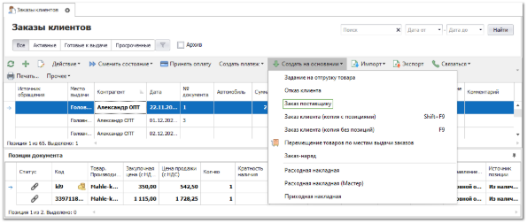
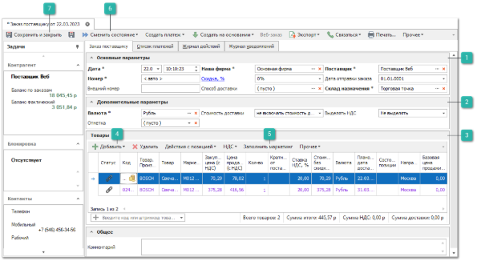
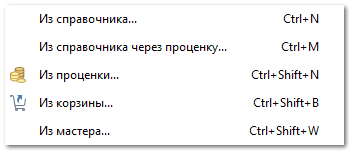
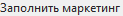
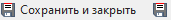

Если в Заказе клиента есть позиции "под заказ", то необходимо на основании такого заказа сформировать и отправить заказ поставщикам данных деталей, для последующего прихода и отгрузки деталей. Для этого выполните следующие действия:

**»** В **Главном меню** выберите пункт **CRM** ► **Заказы клиентов**. Отобразятся элементы выбранного пункта. 

**»** Выберите заказ, по которому необходимо сформировать заказа поставщику и выберите в меню команды **Создать на основании** пункт **Заказ поставщику**.

**»** Программа выберет все позиции с источником "под заказ" в заказе клиента сформирует один или несколько документов **Заказ поставщику**, раздельных по параметру **Поставщик из маркетинга** в позициях заказа клиента. Откроется окно инспектора для редактирования документа.

**»** Заполните необходимые параметры документа (обязательные для заполнения поля выделены жирным шрифтом).

 **Основные параметры**

Блок содержит параметры:

- **Номер** – порядковый номер документа (доступен ручной ввод). Формат и счетчик для формирования номера документа определяется правилом в разделе меню **Управление ► Справочники ► Счетчик номеров документов**;

- **Дата** – дата и время создания документа;

::: info Примечание

Для определения даты и времени программа использует данные компьютера пользователя или время компьютера, где расположена база данных, при активной настройке **Использовать локальное время сервера БД** в разделе меню **Управление ► Настройки программы ► Настройки** блок **Системные настройки**.

Возможность ручного редактирования **Даты** и **Номера документа** для пользователя определяется опциями **Можно редактировать дату и время документа** и **Можно редактировать номер документа** в разделе меню **Управление ► Настройки программы ► Роли пользователей ► Документы ► Заказы поставщикам**.

:::

- **Наша фирма** – наша фирма от которой оформляется заказ;

- **Скидка/Наценка, %** (значение меняется при нажатии на имя поля) – значение процента скидки или наценки, которое применяется на все позиции документа. Доступ к полю определяется разрешением пользователя **Можно изменять скидку/наценку** в разделе меню **Управление ► Настройки программы ► Роли пользователей ► Документы ► Заказы поставщикам**.

::: info Примечание

Значение можно указывать в процентах в поле **Скидка (расчетная), %**, или указать непосредственно **Сумму скидки.** Значения полей рассчитываются автоматически на основании значения второго поля.

:::

- **Способ доставки**– укажите способ доставки товара от поставщика;

- **Поставщик** – поставщик, у которого заказывается товар (поле заполняется автоматически из данных **Поставщик из маркетинга** позиций заказа клиента);

::: info Примечание

Если в карточке выбранного поставщика заполнено поле **Способ доставки**, то оно автоматически подставится в документ **Заказ поставщику** в соответствующее поле.

:::

- **Дата отправки заказа** – дата, когда заказ будет размещен;

- **Склад назначения** – склад либо торговая точка, на которую необходимо переместить товар после оприходования. Перемещение осуществляется через вызов мастера **Перемещение товара по ТТ** из списка приходных накладных;

- **Внешний номер** – внешний номер документа;

::: info Примечание

Для пользователя может быть разрешено изменения поля **Внешний номер** даже после проводки документа. Разрешение регулируется опцией **Можно изменять внешний номер документа после проводки** в разделе меню **Управление ► Настройки программы ► Роли пользователей ► Документы ► Заказы клиентов**.

:::

 **Дополнительные параметры**

Блок содержит параметры:

- **Валюта** – валюта цен в документе. Если изменить валюту документа программа предложит сконвертировать цены на позиции к валюте документа по текущему курсу для валют;

- **Отметка** – выберите отметку для документа из справочника Отметки в документах.

- **Стоимость доставки** – укажите влияние стоимости доставки на цену закупа:

    - **Не включать стоимость доставки** – суммарное значение по колонке **Стоимость доставки** не будет влиять на общую сумму документа;

    - **Включать стоимость без учета скидки** – сумма колонки **Стоимость доставки** будет прибавлена к сумме по документу;

    - **Включать стоимость с учетом скидки** – на стоимость доставки будет действовать **Скидка/Наценка, %** по документу;

- **Выделять НДС** – определяет наличие ставки НДС при расчете стоимости позиций, по умолчанию значение берется из карточки **Нашей фирмы**. При необходимости значение можно изменить.

 **Товары**

Содержит список товаров для заказа поставщику. При создании документа на основании **Заказа клиента**, позиции автоматически будут скопированы из документа-родителя.

 **Добавить**

Позволяет дополнительно добавить товары в заказ**.** Доступны следующие источники позиций:

- **Из справочника** – позиция будет добавлена в документ без цен из справочника **Товары**;

- **Из справочника через проценку** – позицию можно будет выбрать вначале в справочнике товаров, а затем она будет передана в **Проценку** для подбора предложений;

- **Из проценки** – программа откроет окно Проценки для подбора позиций в документ;

- **Из корзины** – позиции будут добавлены из корзины;

- **Из мастера** – позволяет добавить позиции, которые необходимо заказать из **Мастера Заказа поставщику**.

::: info Примечание

Данные по позиции заполняются автоматически на основе информации из родительского заказа клиента или источника, из которого происходило добавление. При необходимости, заполните/измените данные по позиции.

:::

 **Заполнить маркетинг**

Позволяет автоматически подставить информацию о позиции из существующих **Маркетингов**. Доступна подстановка:

- **Закупочной цены (с НДС)** – цена закупа детали у поставщика;

- **Цены продажи (с НДС)** – цена на товар с учетом маркетинга;

Заполнить маркетинг можно как для одной позиции из документа, нажав кнопку **Обновить**, так и для всех, нажав кнопку **Для всех** в открывшемся окне.

::: info Примечание

Функция **Заполнить маркетинг** в **Заказах поставщику** доступна только для позиций с пустым полем **Маркетинг** из источника – **Прайс-лист поставщика**.Функция активна только для не проведенных документов.

:::

::: info Примечание

Для подстановки цен по позиции выполняется проценка с поиском позиции в источниках (из маркетинга, под заказ, в пути). Проценка осуществляется в 3 этапа, аналогичным при проценке в документе **Заказ клиента**. В качестве результата, по прошествии 3х этапов проценки, берется первый из списка товар.

:::

 **Сменить состояние**

Позволяет осуществить проводку документа или отменить ее, в случае необходимости.  А так же добавить документ в архив или извлечь его из архива.

 **Сохранить и закрыть/Сохранить**

Позволяет сохранить и закрыть/сохранить документ **Резерв из наличия** без проводки.

**»** Для вступления документа **Заказ поставщику** в силу его необходимо провести. Для этого нажмите кнопку **Сменить состояние** и выберите пункт **Провести** (Ctrl+E).

**»** Для того чтобы сохранить и закрыть документ без проведения воспользуйтесь кнопкой **Сохранить и закрыть** (F2).

::: info Примечание

При активной опции **Учитывать место выдачи товара** в **Заказе клиента** в разделе меню **Управление ►** **Настройки программы ► Настройки,** группа **Уведомления** уведомление о готовности заказа клиента к выдаче будет уходить только в случае, если товар был оприходован либо перемещен на склад/торговую точку, которая указана в качестве **Места выдачи** товара в параметрах **Заказа клиента**.

:::

После поступления товара от поставщика рекомендуется сформировать приход товара на склад с использованием **Мастера приходной накладной** и дальнейшее перемещение пришедших позиций на **Места выдачи** из заказов клиентов. После чего клиенту может быть отправлено уведомление о готовности заказа.