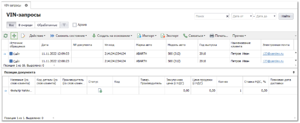
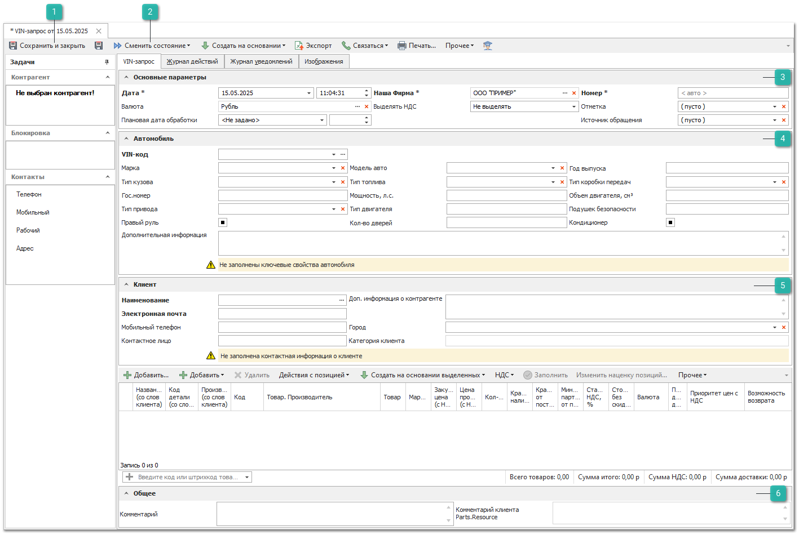
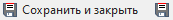
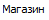
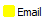
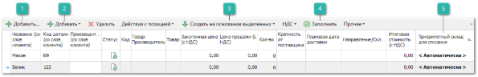
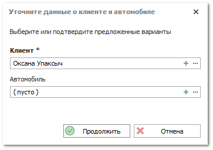
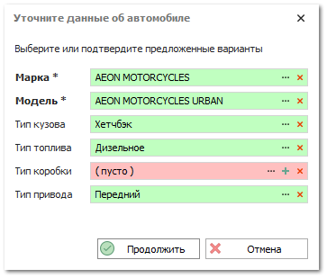

Для формирования **VIN-запроса** выполните следующие действия:

**»** В **Главном меню** выберите пункт **CRM ► VIN-запросы**. 

**»** Для добавления нового документа нажмите кнопку **Новый** на панели инструментов. Отобразится окно инспектора для добавления нового запроса.

**»** Заполните необходимые поля формы документа (обязательные для заполнения поля выделены жирным шрифтом):

 **Сохранить и закрыть/Сохранить**

Позволяет сохранить и закрыть/сохранить VIN-запрос без проводки.

 **Сменить состояние**

Позволяет осуществить проводку документа или отменить ее, в случае необходимости. А так же добавить документ в архив или извлечь его из архива.

 **Основные параметры**

Блок содержит поля:

- **Дата** – дата и время создания **VIN-запроса**;

- **Наша фирма** – фирма, от имени которой оформляется запрос;

- **Номер** – номер документа. Возможен как ручной ввод, так и автозаполнение;

- **Валюта** – валюта документа;

- **Выделять НДС** – использование НДС в документе. По умолчанию значение берется из карточки **Нашей фирмы**, в документе;

- **Отметка** – отметка для документа из справочника **Отметки в документах**;

- **Плановая дата обработки** – дата и время, до которых **VIN-запрос** планируется обработать, т.е. провести документ;

- **Источник обращения** – источник добавления документа в журнал. Возможные источники и отметки:

    -  – документ был передан с сайта Parts.Resource при тике синхронизации;

    -  – документ был создан из окна звонка. Доступно при наличии подключенной IP-телефонии;

    -  – источник, который можно присвоить документам вручную;

    -  – документ загружен с почты с использованием правила из раздела **CRM ► Автоимпорт заказов клиентов**.

::: info Примечание

Источники **Сайт**, **Звонок**, **Email** присваиваются документам автоматически. При необходимости источник можно изменить вручную.

:::

::: info Примечание

Отредактировать источники и цвета отметок можно в разделе **Управление** ► **Справочники** ► **Источники обращений**.

:::

 **Автомобиль**

Блок содержит поля:

- **VIN-код** – VIN-кода автомобиля. При вводе символов осуществляется поиск по вхождению этих символов в VIN-коды уже существующих автомобилей из справочника **Автомобили** (меню **CRM**) либо среди документов **VIN-запрос** с аналогичной последовательностью символов в VIN-кодах. Результаты поиска представлены в выпадающем списке, иконкой указан источник ( – справочник,  – документ). Если выбрать автомобиль из справочника, то данные об автомобиле перенесутся на форму документа. Если из другого VIN-запроса, то в появившемся диалоге требуется выбрать, что перенести на форму: только данные об автомобиле или данные об автомобиле и клиенте.

::: info Примечание

Кроме ручного ввода или выбора из предлагаемых вариантов существует возможность выбрать автомобиль из справочника.

:::

::: info Примечание

Заполнение поля VIN-код является основанием считать, что информация об автомобиле заполнена в достаточном объеме. Если VIN-код не заполнен, то программа проверяет одновременное заполнение полей Марка, Модель и Год выпуска. Если информации об автомобиле недостаточно, выведется уведомление: *Не заполнены ключевые свойства автомобиля*.

:::

- **Марка** – марка автомобиля. Допускается выбор из справочника или ввод произвольного текста. При вводе текста осуществляется поиск позиций в связанном справочнике, которые отображаются в выпадающем списке с возможностью выбора;

- **Модель авто** – модель автомобиля. Допускается выбор из справочника или ввод произвольного текста. При вводе текста осуществляется поиск позиций в связанном справочнике, которые отображаются в выпадающем списке с возможностью выбора. Список формируется на основании выбранной марки автомобиля. Если марка не указана, то список моделей будет пуст;

- **Год выпуска** – год выпуска автомобиля.

При необходимости заполните дополнительную информацию об автомобиле клиента: **Тип кузова**; **Тип топлива**; **Тип коробки передач**; **Гос. Номер**; **Мощность, л.с.**; **Объем двигателя, см3**; **Тип привода**; **Тип двигателя**; количество **Подушек безопасности**; **Правый руль**; **Количество дверей**; **Кондиционер**, а также **Дополнительную информацию**.

 **Клиент**

Блок содержит поля:

- **Наименование** – наименование контрагента. Клиента можно выбрать из справочника контрагентов или ввести данные клиента для поиска по справочнику. Поиск ведется по наименованию, коду, номеру дисконтной карты, номерам телефона и мобильного телефона, электронной почте, номеру ИНН, а также системному штрихкоду клиента. При вводе текста предлагается список клиентов из справочника, у которых встречается введенная последовательность символов. Если был выбран существующий контрагент из справочника, то программа привяжет его к документу. Но если изменить любое свойство на форме документа, то связь удаляется. Это влечет за собой сброс категории клиента на форме (на категорию клиентов по умолчанию для VIN-запросов). В дополнение к этому, при выборе клиента из справочника **Контрагентов** в поле **VIN-код** автомобиля открывается список автомобилей, принадлежащих данному клиенту;

- **Электронная почта** – адрес электронной почты клиента;

- **Моб. телефон клиента** – мобильный телефон клиента;

::: info Примечание

Ввод мобильного телефона осуществляется согласно заданной маске ввода по умолчанию в разделе настроек **Контрагенты**.

:::

- **Контактное лицо** – контактное лицо контрагента.

 **Клиент**

Блок содержит поля:

- **Комментарий** – позволяет оставить комментарий к VIN-запросу;

- **Комментарий клиента Parts.Resource** – содержит комментарий клиента к VIN-запросу, полученный с сайта Parts.Resource.

::: info Примечание

Поле **Комментарий клиента Parts.Resource** доступно при подключенной услуге **Синхронизатор**. Подробнее читайте в [руководстве пользователя](https://product-doc.tradesoft.ru/ai/synch/index.htm).

:::

**»** После заполнения необходимых параметров документа, добавьте запрашиваемые клиентом позиции в табличную часть. 

 **Добавить**

Позволяет добавить новую позицию, в которой заполняется информация со слов клиента.

 **Добавить из**

Позволяет добавить товар из источника, если товар не удается найти по данным со слов клиента применив команду **Заполнить**.

Для добавления товара доступны источники:

- **Из справочника** – выбирается товар из справочника **Товары**;

- **Из проценки** – открывается окно **Проценки** для поиска и добавления товара;

- **Копия позиции** – создается копия выделенной позиции.

 **Создать на основании выделенных**

Содержит команду **Заказ клиента** и **Расходная накладная**, которая позволяет на основании выделенных позиций в документе **VIN-запрос** создать документ **Заказ клиента**. Для создания заказа в инспекторе документа **VIN-запрос** в таблице с позициями необходимо выделить нужные записи, выполнить команду на панели инструментов **Создать на основании выделенных** и выбрать нужный для создания документ.

::: info Примечание

Создание **Заказа клиента** и **Расходной накладной** на основании выделенных позиций в **VIN-запросе** доступно только в проведенном документе и при условии, что пользователю разрешено их создание. Разрешения задаются в меню **Управление ►** **Настройки программы ► Роли пользователей ► Разрешения для роли пользователей ► Документы**.

:::
Информация по позициям в **Заказе клиента** заполняется на основании информации в **VIN-запросе** за исключением данных поля **Валюта**. В качестве валюты используется **Основная валюта** Нашей фирмы, которая задается в ее карточке. Цены в документах автоматически конвертируются в подставленную валюту.

Создаваемые документы не связываются с **VIN-запросами**, соответственно, не отображаются в **Навигации по связям**.

 **Заполнить**

Позволяет, при обработке **VIN-запроса**, привязать к товару со слов клиента  – карточку товара из справочника (колонка **Товар**). При успешной привязке карточки товара поля заполнятся автоматически.

::: info Примечание

Для срабатывания кнопки **Заполнить** необходимо указать **Код детали (со слов клиента) **. Для более точного подбора товара должны быть заполнены **Производитель (со слов клиента) ** или **Название (со слов клиента) **.

:::

 **Приоритетный склад для списания**

В позициях документа присутствует возможность указать **Приоритетный склад для списания** в колонке с одноименным названием. С помощью данного поля можно выбрать склад и место хранения, с которых требуется осуществлять списание товара.

::: info Примечание

В случае отсутствия товара на выбранном **Складе**, списание товара будет произведено со вложенных в этот склад **Мест хранений** (при активном значении настройки **Подбирать товары сначала на приоритетном складе/ТТ, а затем на вложенных в него МХ** из раздела **Управление ► Настройки программы ► Настройки ►** группа **Склад и закупки** ► **Движение товара**).В случае отсутствия товара на выбранном **Месте хранения**, списание товара будет произведено со вложенных в него **Мест хранений** (при активном значении настройки **Перемещать товары сначала с выбранного МХ, а затем с вложенных в него МХ** из раздела **Управление ► Настройки программы ► Настройки ►** группа **Склад и закупки** ► **Движение товара**).

:::
По умолчанию списание товара (в момент проводки) будет осуществляться среди всех складов **Доступных для списания** пользователю, по действующему в системе **Способу списания товара ФИФО/ЛИФО** в разделе меню **Управление ► Настройки программы ► Настройки ►**, группа **Склад и закупки ► Движение товара**.

**»** **VIN-запрос** считается обработанным после того, как документ проведен. Для этого на панели инструментов нажмите кнопку **Сменить состояние** и выберите пункт **Провести** (Ctrl+E).

**»** Для того чтобы сохранить и закрыть документ (без проведения) воспользуйтесь кнопкой **Сохранить и закрыть** (F2).

Если в документе есть ссылки на контрагента и автомобиль, т.е. они выбраны из уже существующих в программе, то документ будет проведен без дополнительных запросов.

Если документ не связан с контрагентом или автомобилем из справочников программы, то при проведении появится диалоговое окно. Уточнение информации необходимо для возможности последующего создания на основании **VIN-запроса** документа **Заказ клиента**.

На форме необходимо выбрать клиента и автомобиль из справочников, либо создать новых.

При создании клиента данные из документа будут переданы в инспектор создания нового контрагента. Если в секции **Автомобиль** какое-либо значение из выпадающих списков было введено вручную, а не выбрано из существующих, то при создании автомобиля потребуется дополнить связанные с автомобилем справочники новой информацией. 

На форме зеленым цветом фона выделены поля, значения в которых были выбраны в соответствующих справочниках. Красным фоном выделены либо незаполненные, либо отсутствующие в соответствующих справочниках свойства. Для добавления текущего значения в справочник нажмите на кнопку . Для выбора из существующих значений нажмите . С помощью кнопки  можно очистить содержимое значения. Обязательными для заполнения являются **Марка** и **Модель автомобиля**. Если остальные поля оставить несвязанными со справочниками, то они не будут переданы в инспектор нового автомобиля.