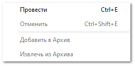

После формирования приходных накладных на позиции, связанные с заказами клиентов, товар автоматически резервируется на складе под данного клиента. При этом отгрузить товар можно только данному клиенту.

Для выдачи клиенту пришедших позиций выполните следующие действия:

**»** В **Главном меню** выберите пункт **CRM** ► **Заказы клиентов**. Отобразятся элементы выбранного пункта.

 **Расходная накладная**

Позволяет сформировать **Расходную накладную** на основании выбранного заказа клиенту.

 **Перемещение товаров по местам выдачи заказов**

Позволяет создать на основании заказа перемещение товаров, если в заказе присутствует товар "из наличия", который находится на складе/торговой точке, отличной от **Места выдачи**. В таком случае программа создаст и откроет документ перемещения для товаров из наличия на **Место выдачи**, указанное в параметрах **Заказа клиента**.

**»** Выберите заказ, по которому необходимо сформировать расходную накладную и выберите в меню команды **Создать на основании** пункт **Расходная накладная**.

**»** Программа выберет все позиции в состоянии "резерв" и сформирует **Расходную накладную.** Откроется окно инспектора для редактирования документа.

**»** Заполните необходимые параметры документа (обязательные для заполнения поля выделены жирным шрифтом).

 **Основные параметры**

Блок содержит параметры:

- **Доверенность** – выберите доверенность, по которой выдается товар;

- **Номер счета-фактуры и Дата счета-фактуры** – если клиент уже расплатился за получаемый товар, то нажмите один раз на кнопку , тем самым на единицу увеличится порядковый номер счет-фактуры. Для печати документа нажмите кнопку **Печать**, и выберите шаблон **Счет-фактура**;

- **Дата** – дата и время создания документа;

- **Номер** – порядковый номер документа (доступен ручной ввод). Формат и счетчик для формирования номера документа определяется правилом в разделе меню **Управление ► Справочники ► Счетчики номеров документов**;

::: info Примечание

Для определения даты и времени программа использует данные компьютера пользователя или время компьютера, где расположена база данных, при активной настройке **Использовать локальное время сервера БД** в разделе меню **Управление ► Настройки программы ► Настройки,** блок **Системные настройки**.

Возможность ручного редактирования Даты и Номера документа для пользователя определяется опциями **Можно редактировать дату и время документа** и **Можно редактировать номер документа** в разделе меню **Управление ►** **Настройки программы ► Роли пользователей ► Документы ► Расходные накладные**.

:::

- **Номер счета на оплату** и **Дата счета на оплату** – если оплата товара производится по безналичному расчету, то нажать один раз на кнопку , тем самым на единицу увеличится порядковый номер счета на оплату. Для печати документа нажать **Печать** и выберите шаблон Счета на оплату;

::: info Примечание

Возможность ручного редактирования Номера счета-фактуры и Номера счета на оплату для пользователя определяется опцией **Можно изменять вручную номер счета-фактуры** и **Можно изменять вручную номер счета на оплату** в разделе меню **Управление ►** **Настройки программы ► Роли пользователей ► Документы ► Расходные накладные**.

:::
::: info Примечание

В разрешениях пользователя в разделе меню **Управление ► Настройки программы ► Роли пользователей** ► **Документы** ► **Расходные накладные** можно задать обязательность заполнения номера счета-фактуры и/или счета на оплату для проводки РН в свойстве **Обязательные к заполнению поля**.

:::

- **Наша фирма –** наша фирма, от которой будет осуществляться отгрузка товара;

::: warning Внимание!

Стоит учесть значение настройки **Контролировать движение товара по нашей фирме** в разделе меню **Управление ► Настройки программы ► Наши фирмы**, при активации которой запрещается списание товара по расходной накладной оформленной на Нашу фирму, отличную от той, которая в приходе.

:::

- **Скидка/Наценка, %** (значение меняется при нажатии на имя поля) – значение процента скидки или наценки, которое применяется на все позиции документа. Доступ к полю определяется разрешением пользователя **Можно изменять скидку/наценку** в разделе меню **Управление ► Настройки программы ► Роли пользователей ► Документы ► Расходные накладные**.

::: info Примечание

Значение можно указывать в процентах в поле **Скидка (расчетная), %**, или указать непосредственно **Сумму скидки.** Значения полей рассчитываются автоматически на основании значения второго поля.

:::

- **Способ доставки** – укажите способ доставки товара от поставщика;

- **Клиент** – клиент, которой покупает товар (покупатель);

- **Грузополучатель** – контрагент, который получает товар. Если поле не заполнено, то грузополучатель и плательщик – один контрагент (поле используется в печатных бланках Торг-12 и Счет-фактура);

- **Отсрочка платежа, дн.** – количество дней для отсрочки оплаты **Расходной накладной**, по истечению которого долг по документу попадает в **Баланс просроченный**. По умолчанию подставляется из карточки контрагента.

::: warning Внимание!

Право на изменение **Отсрочки платежа** в **Расходных накладных** определяется разрешением для пользователя в разделе **Управление ►** **Настройки программы ► Роли пользователей ► Разрешения для роли пользователей ► Документы ► Расходные накладные** пункт **Можно изменять отсрочку платежа**.

:::
::: info Примечание

При создании документа **Расходная накладная** на основании документа **Заказ клиента** в расходной накладной автоматически заполняются следующие данные. Данные заполняются, если они были заполнены в заказе клиента:
- **Наша фирма**;
- **Способ доставки**;
- **Номер счета на оплату**;
- **Клиент**;
- **Грузополучатель** (данные берутся из карточки контрагента);
- **Отсрочка платежа, дн** (данные берутся из карточки контрагента).

:::

 **Дополнительные параметры** 

Блок содержит параметры:

- **Валюта** – валюта цен в документе. Если изменить валюту документа, программа предложит сконвертировать цены на позиции к валюте документа по текущему курсу для валют;

- **Отметка** – выберите отметку для документа из справочника;

- **Стоимость доставки** – укажите влияние стоимости доставки на цену закупа:

    - **Не включать стоимость доставки** – суммарное значение по колонке **Стоимость доставки** не будет влиять на общую сумму документа;

    - **Включать стоимость без учета скидки** – сумма колонки **Стоимость доставки** будет прибавлена к сумме по документу;

    - **Включать стоимость с учетом скидки** – на стоимость доставки будет действовать **Скидка/Наценка, %** по документу.

- **Выделять НДС** – при необходимости, измените значение. По умолчанию значение берется из карточки **Нашей фирмы**.

::: info Примечание

При создании документа **Расходная накладная** на основании документа **Заказ клиента** в расходной накладной автоматически заполняется поле **Валюта**.

:::

 **Товары**

Содержит список товаров для выдачи клиенту. При создании документа на основании заказа клиента, позиции автоматически будут скопированы из документа-родителя.

 **Добавить**

Позволяет дополнительно добавить товары в расходную накладную. Доступны следующие источники позиций:

- **Из справочника –** позиция будет добавлена в документ без цен из справочника **Товары**;

- **Из справочника через проценку** – позицию можно будет выбрать вначале в справочнике товаров, а затем она будет передана в **Проценку** для подбора предложений;

- **Из проценки** – программа откроет окно **Проценки** для подбора позиций в документ;

- **Из проценки (штрихкод) ** – выбирается товар через поиск в **Проценке** по штрих-коду;

- **Из корзины** – позиции будут добавлены из корзины;

- **Из мастера** – позволяет добавить позиции, которые необходимо заказать из **Мастера Расходной накладной**;

- **Копия позиции** – создастся копия выделенной позиции документа.

::: info Примечание

Данные по позиции заполняются автоматически на основе информации из родительского заказа клиента или источника, из которого происходило добавление. При необходимости, заполните/измените данные по позиции.

:::

 **Заполнить маркетинг**

Позволяет автоматически подставить информацию о позиции из существующих **Маркетингов**. Доступна подстановка:

- **Закупочной цены (с НДС)** – цена закупа детали у поставщика;

- **Цены продажи (с НДС)** – цена на товар с учетом маркетинга;

- **Направления/ склада** – направление поставки или склад из прайс-листа;

- **Приоритетного склада для списания** – склад, с которого требуется осуществлять списание товара;

Заполнить маркетинг можно как для одной позиции из документа, нажав кнопку **Обновить**, так и для всех, нажав кнопку **Для всех** в открывшемся окне.

::: info Примечание

Функция **Заполнить маркетинг** в **Расходных накладных** доступна только для позиций с пустым полем **Маркетинг** из источника – **Прайс-лист из наличия**.Функция активна только для не проведенных документов.

:::
::: info Примечание

Для подстановки цен по позиции выполняется проценка с поиском позиции в источниках (из маркетинга, из наличия). Проценка осуществляется в 3 этапа, аналогичным при проценке в документе **Заказ клиента**.

:::

 **Коды маркировок** 

Позволяет осуществить удаление или редактирование кодов маркировок, для **Маркированных товаров** (раздел **Товары и цены** **► Товары**). Работа с кодами маркировки и их ввод описаны в разделе **Заполнение кодов маркировки**.

 **Приоритетный склад для списания**

Позволяет задать склад и место хранения, с которых требуется осуществлять списание товара.

::: info Примечание

В разрешениях пользователя (**Управление ► Настройки программы ► Роли пользователей ► Разрешения для роли пользователей**) есть возможность установить вывод уведомления при резервировании/списании товара из наличия в момент проведения документа. Для документа **Расходная накладная** доступна опция **Списание/резервирование товаров со складов/МХ, отличных от приоритетного**, которая активирует при проводке документа проверку доступного количества товара на складе, установленном в качестве **Приоритетного склада для списания** по позиции. Если количество товара из наличия в заказе недостаточно на приоритетном складе, то программа выдаст уведомление в зависимости от значения данной настройки.

:::
::: info Примечание

В случае отсутствия товара на выбранном **Складе**, списание товара будет произведено со вложенных в этот склад **Мест хранений** (при активном значении настройки **Подбирать товары сначала на приоритетном складе/ТТ, а затем на вложенных в него МХ** из раздела **Управление ► Настройки программы ► Настройки ►** группа **Склад и закупки** ► **Движение товара**).

В случае отсутствия товара на выбранном **Месте хранения**, списание товара будет произведено со вложенных в него **Мест хранений** (при активном значении настройки **Перемещать товары сначала с выбранного МХ, а затем с вложенных в него МХ** из раздела **Управление ► Настройки программы ► Настройки ►** группа **Склад и закупки** ► **Движение товара**).

:::

Указать приоритетный склад для списания можно как в самой позиции документа, так и сразу для нескольких позиций с помощью команды **Действия с позицией ► Приоритетный склад** на панели инструментов. При этом Место хранения, с которого необходимо выполнить списание товара можно выбрать только по позиции документа.

По умолчанию списание товара (в момент проводки) будет осуществляться среди всех складов **Доступных для списания** пользователю, по действующему в системе **Способу списания товара ФИФО/ЛИФО** в разделе меню **Управление ► Настройки программы ► Настройки ►** группа **Склад и закупки ► Движение товара**.

 **UDS**

Позволяет осуществить начисление/списание баллов, предоставление скидки в момент продажи товара клиенту, используя сервис UDS.

::: info Примечание

Доступность данной функции определяется состоянием подписки и наличием подключенной услуги. Условия подключения можно узнать у наших менеджеров (контактные данные можно найти по адресу [www.tradesoft.ru/about/contacts](http://www.tradesoft.ru/about/contacts/)).Подробнее о работе с сервисом **UDS** читайте в [руководстве пользователя](https://product-doc.tradesoft.ru/ai/uds/index.htm). 

:::

 **Сменить состояние**

Позволяет осуществить проводку документа или отменить ее, в случае необходимости.  А так же добавить документ в архив или извлечь его из архива.

 **Сохранить и закрыть/Сохранить**

Позволяет сохранить и закрыть/сохранить документ **Резерв из наличия** без проводки.

**»** Для вступления документа в силу и списания товара со склада его необходимо провести. Для этого нажмите кнопку **Сменить состояние** и выберите пункт **Провести** (Ctrl+E).

**»** Для того чтобы сохранить и закрыть документ (можно и без проведения), воспользуйтесь кнопкой **Сохранить и закрыть** (F2).

::: warning Внимание!

Проведение документа расходной накладной может быть заблокировано программой при наличии одного или нескольких ограничений:

- **Склад/торговая точка**, с которой осуществляется списание, находится в данный момент на инвентаризации;

- **Склад/торговая точка**, выбранный в параметрах документа, отсутствует в **Списке складов/ТТ, с которых доступно списание товара** в разрешениях пользователя;

- В документе присутствуют маркированные товары (опция **Маркированный товар** в карточке товара) и коды маркировок не заполнены, кодов недостаточно или избыточно. Также если в документе имеются коды, а товаров, подлежащих маркировке нет, то проводка блокируется;

- при установке иных ограничений для пользователя в разделе главного меню **Управление ► Настройки программы ► Роли пользователей** ► **Документы ► Расходные накладные**.

:::