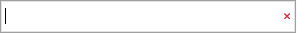
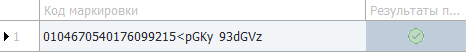

::: warning Внимание!

Для заполнения кодов маркировки необходимо включить и заполнить соответствующие опции. Подробнее читайте в разделе [**Подключение проверки кодов маркировки**](../../markirovka/podklyuchenie_proverki_kodov_markirovki.md).

:::

::: info Примечание

Данные о маркировке передаются в кассовый чек (а затем оператору фискальных данных), а также в систему электронного документооборота **Диадок**.Подробнее о работе с сервисом **Диадок** читайте в [руководстве пользователя](https://product-doc.tradesoft.ru/ai/diadok/index.htm).

:::

::: note Замечание

Заполнение кодов маркировки также доступно для документов [**Возврат клиента**](../formirovanie_vozvrata_ot_klienta.md) и **Корректировка расходной накладной**. Но при этом коды маркировки не отправляются в сервис «Честный знак». Заполнение кодов маркировки в этих документах необходимо для корректного сопоставления товаров.

:::

Заполнение кодов маркировок для **Маркированных товаров** доступно с помощью команды **Коды маркировок** на **Панели инструментов**.

::: note Замечание

Команда заблокирована, если в документе нет товаров, подлежащих маркировке или их количество (колонка **Кол-во**) равно 0.

:::

::: info Примечание

При проверке кодов производится запрос в систему ГИС МТ на получение списка CDN-площадок и их приоритизация по наилучшему времени проверки кода внутри площадки.Если система ГИС МТ недоступна, например, отсутствует подключение к Интернету, то происходит запрос в локальный модуль «Честного знака», если он настроен и подключен. Подробнее о подключении локального модуля читайте в разделе [**Подключение проверки кодов маркировки**](../../markirovka/podklyuchenie_proverki_kodov_markirovki.md).

:::

Для ввода кодов маркировок выполните следующие действия:

**»** На **Панели инструментов** выполните команду **Коды маркировок**, откроется окно для ввода информации.

::: note Замечание

Возможность ввода кодов маркировки доступна только в не проведенном документе. После проведения доступен просмотр и копирование кодов.

:::

 **Поле ввода кода маркировки**

Позволяет ввести с помощью 2D-сканера штрих-кодов, либо вручную код маркировки после нажатия клавиши Enter, код маркировки отобразится в табличной части.

Команда  позволяет очистить введенное в поле ввода значение.

::: info Примечание

Для автоматического сканирования с очисткой введенного ранее значения в поле ввода необходима настройка префикса по клавише **F6** в сканере. Для автоматического добавления введенного кода в табличную часть необходимо настроить постфикс по клавише **Enter** в сканере.

:::

 **Табличная часть**

Содержит список внесенных кодов маркировки. Содержит колонки:

- **Код маркировки** – выводит проверенный код маркировки;

- **Результаты проверки кода** – выводит результат проверки кода маркировки.

 **Информационный блок**

Отображает количество корректно введенных кодов, количество кодов, которое необходимо внести, а также:

- **Не введено: N** – не введено нужное количество кодов. Значение N отображает количество кодов маркировок, которое необходимо ввести, уменьшается при добавлении новых кодов;

- **Промаркировано** – заполнено необходимое количество кодов маркировок;

- **Переизбыток: N** – введено количество кодов, большее чем количество товара в позиции. Значение N отображается количество избыточных кодов маркировок, увеличивается при добавлении новых кодов.

 **Сохранить**

Позволяет сохранить результаты маркировки товара.

**»** Введите коды маркировки. При вводе кода осуществляется его проверка на соответствие формату, на уникальность для товара и документа в целом, а также отправка кода на CDN-площадки для проверки корректности кода. Возможные уведомления:

- **Код некорректный** – код не соответствует формату;

- **Код уже добавлен** – код уже присутствует в табличной части данного окна;

- **Код уже добавлен в документ** – код уже присутствует в документе для других позиций;

- **Код маркировки не найден в ГИС МТ** – код маркировки не был найден в ГИС МТ **Честный знак** при проверке продукции;

- **Код маркировки эмитирован, но нет информации о его нанесении** – не было найдено информации о нанесении кода маркировки на упаковку;

- **Не пройдена криптографическая проверка кода маркировки** – был получен отрицательный результат проверки крипто-подписи;

- **Код идентификации выведен из оборота** – код был выведен из оборота;

- **Код идентификации заблокирован по решению ОГВ** – код был заблокирован для розничной продажи по решению органа государственной власти;

- **Нет информации о вводе в оборот кода идентификатора** – получен отрицательный ответ по вводу и выводу кода в/из оборот(-а).

**»** Для удаления кода в **Табличной части** нажмите на строку правой кнопкой мыши и выберите пункт **Удалить** или воспользуйтесь сочетанием клавиш **Ctrl+Delete**. Копирование кода доступно по сочетанию клавиш **Ctrl+C**.

**»** По окончанию процесса ввода кодов нажмите кнопку **Сохранить**. Сохранение и закрытие окна недоступно при переизбытке кодов.

::: note Замечание

Информация о статусе маркировки для каждой позиции документа отображается в колонке **Статус маркировки**: коды введены, коды не введены, коды введены частично, введены лишние коды, не требует маркировки.

:::